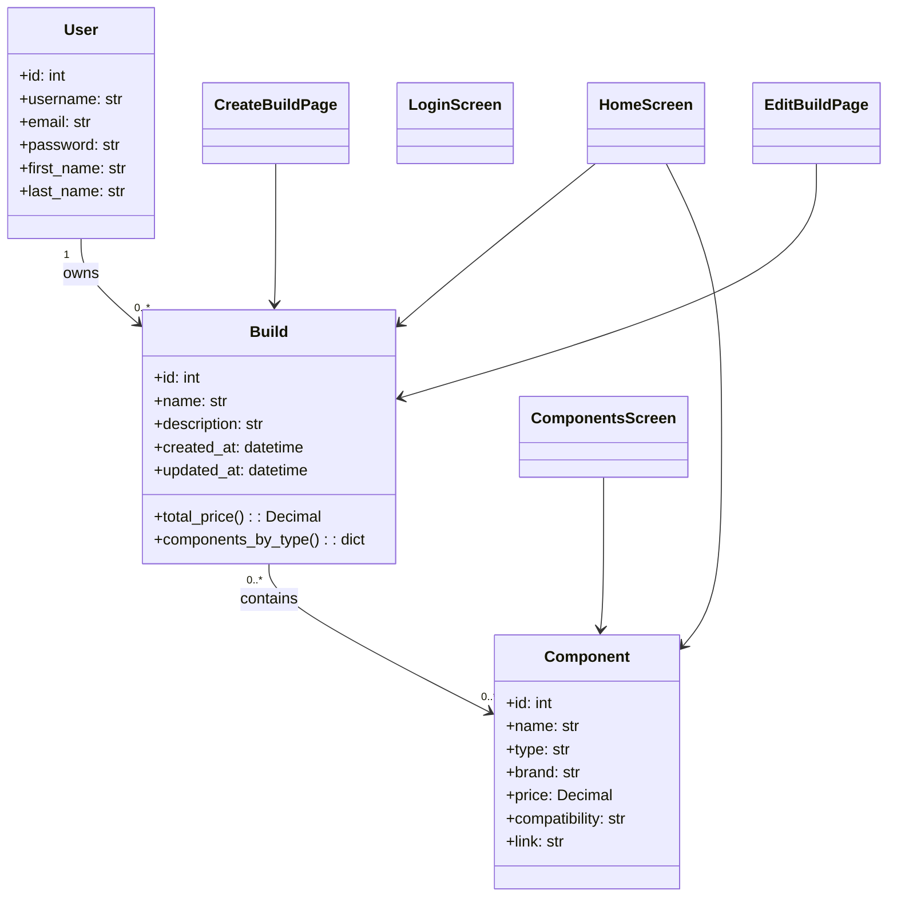
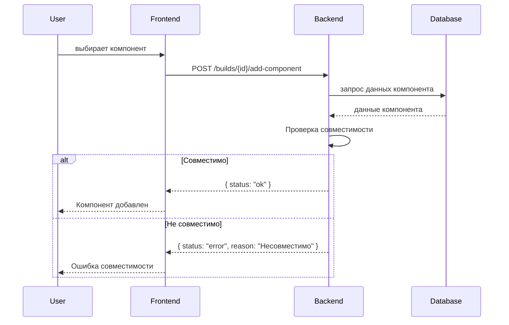
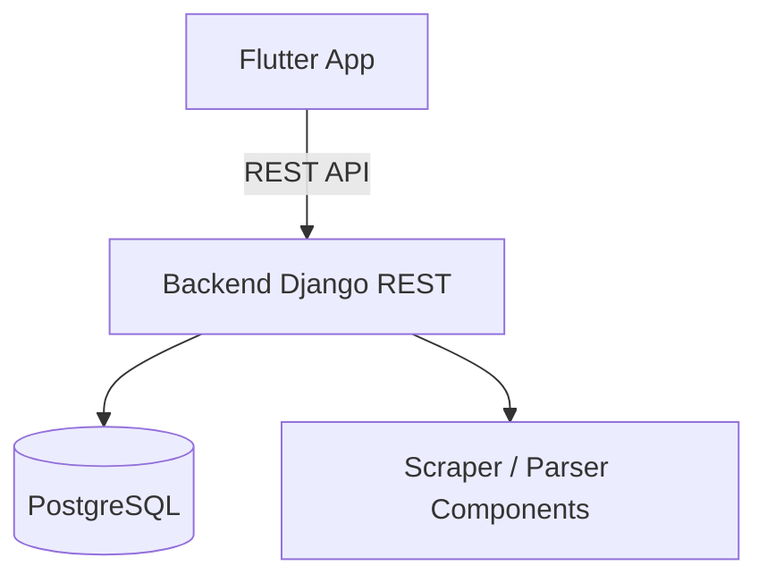
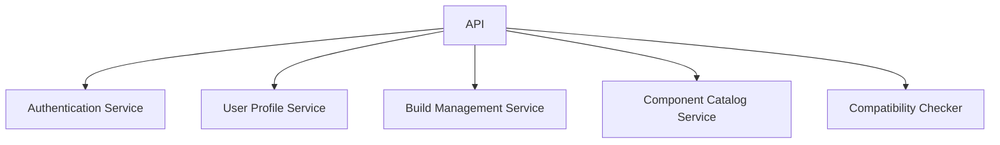
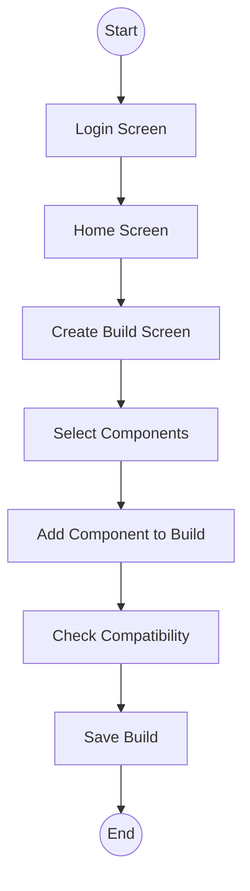

# Architecture Documentation

## Use Case Diagram

```mermaid
%%{init: {'theme': 'default'}}%%
usecaseDiagram
    actor User
    actor System as Backend
    actor App as MobileApp

    User --> (Register)
    User --> (Login)
    User --> (View Home Screen)
    User --> (View Components Catalog)
    User --> (Filter Components)
    User --> (Create Build)
    User --> (Edit Build)
    User --> (Delete Build)
    User --> (Add Component to Build)
    User --> (Remove Component from Build)
    
    App --> Backend
    (Register) --> Backend
    (Login) --> Backend
    (View Components Catalog) --> Backend
    (Filter Components) --> Backend
    (Create Build) --> Backend
    (Edit Build) --> Backend
    (Delete Build) --> Backend
    (Add Component to Build) --> Backend
    (Remove Component from Build) --> Backend

```

## Class Diagram



## Sequence Diagram — Добавление компонента



## C1 — Контекст (System Context)
```mermaid
%%{init: {'theme': 'default'}}%%
graph TB
    User[Пользователь]
    MobileApp[Mobile App (Flutter)]
    Backend[Backend (Django REST API)]
    DB[(PostgreSQL)]
    External[Внешние сервисы: DNS, PCPartPicker]

    User --> MobileApp
    MobileApp --> Backend
    Backend --> DB
    Backend --> External
```

## C2 — Контейнеры


## C3 — Компоненты Backend


## BPMN (Пример сценария “Создание сборки”)

