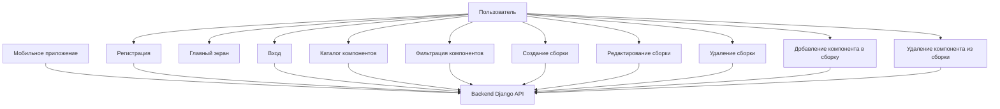
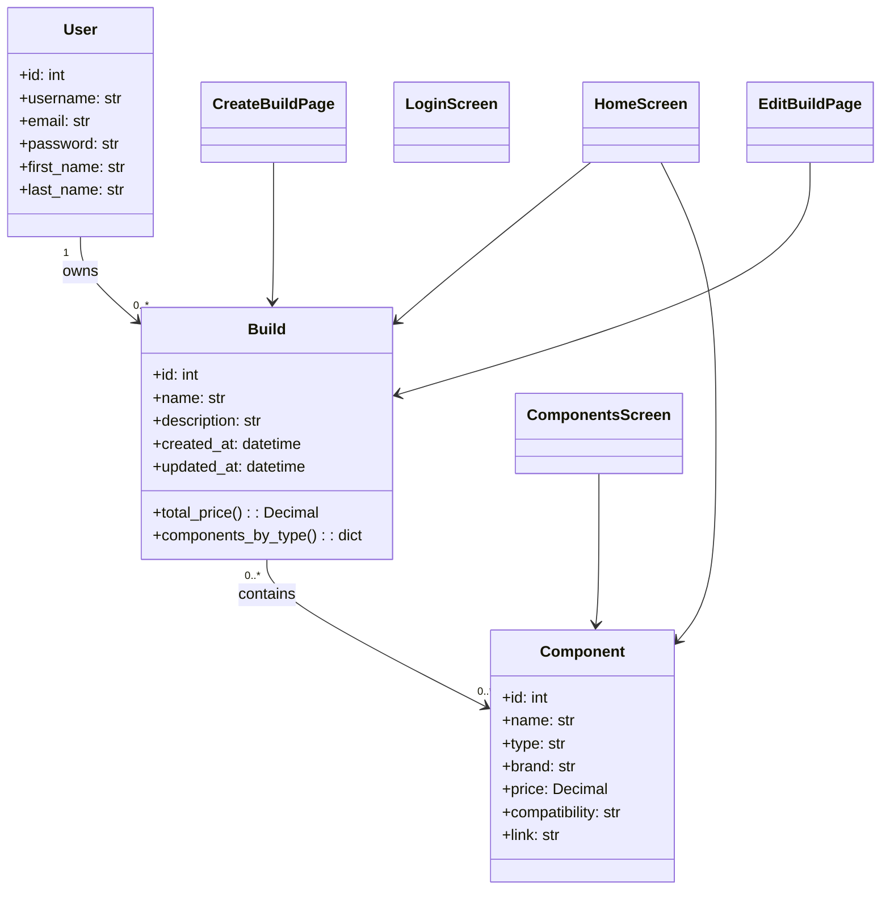
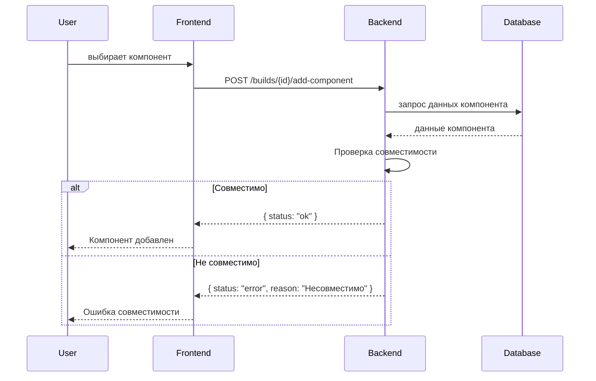
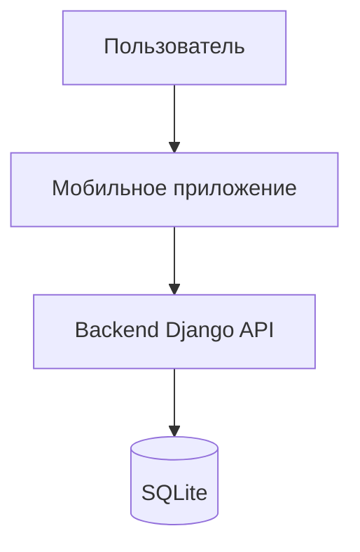
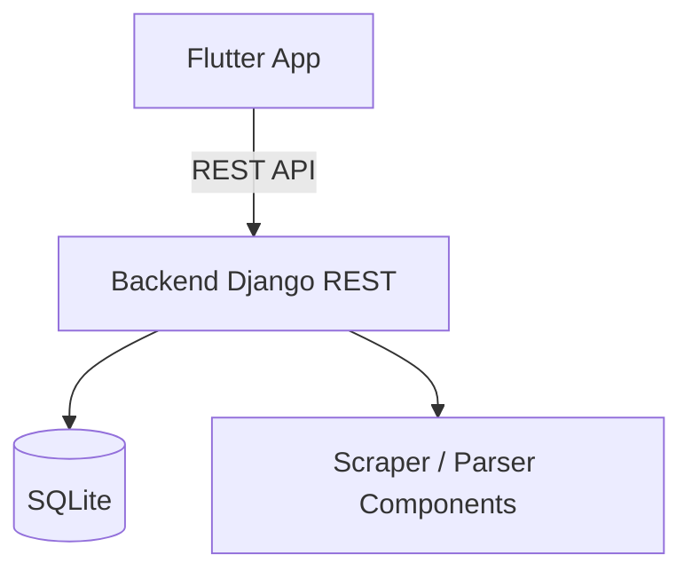
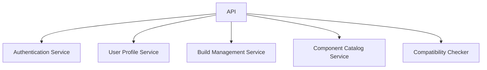
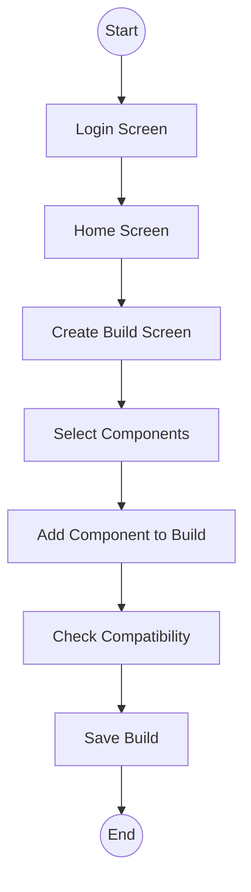

# Архитектура приложения «PC Builder Mobile App»

## UML Use Case

## Class Diagram

## Sequence Diagram — Добавление компонента

## C1 — Контекст (System Context)

## C2 — Контейнеры

## C3 — Компоненты Backend

## BPMN (Пример сценария “Создание сборки”)

