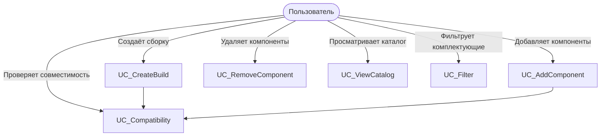
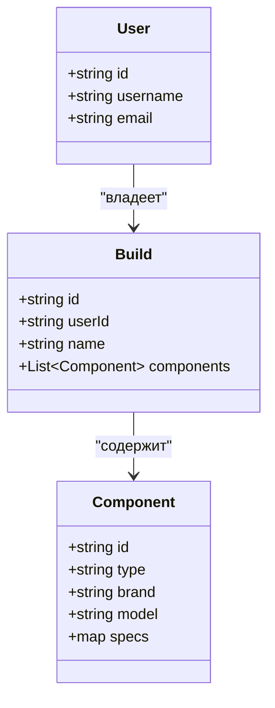
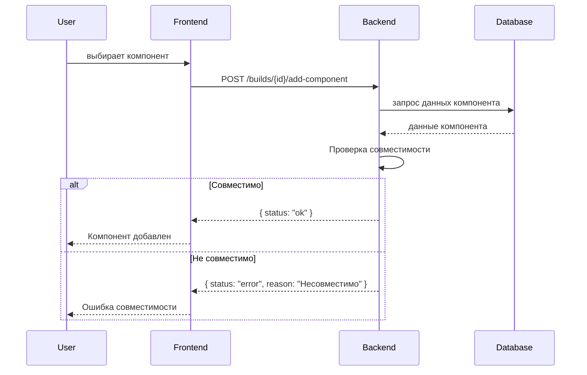

# Architecture Documentation

## Use Case Diagram

```mermaid
flowchart TD
    User([Пользователь]) --> |Создаёт сборку| UC_CreateBuild
    User --> |Добавляет компоненты| UC_AddComponent
    User --> |Удаляет компоненты| UC_RemoveComponent
    User --> |Просматривает каталог| UC_ViewCatalog
    User --> |Фильтрует комплектующие| UC_Filter
    User --> |Проверяет совместимость| UC_Compatibility

    UC_CreateBuild --> UC_Compatibility
    UC_AddComponent --> UC_Compatibility
```

## Class Diagram

```mermaid
classDiagram
    class User {
        +string id
        +string username
        +string email
    }

    class Build {
        +string id
        +string userId
        +string name
        +List~Component~ components
    }

    class Component {
        +string id
        +string type
        +string brand
        +string model
        +map specs
    }

    User --> Build : "владеет"
    Build --> Component : "содержит"
```

## Sequence Diagram — Добавление компонента

```mermaid
sequenceDiagram
    participant U as User
    participant F as Frontend
    participant B as Backend
    participant DB as Database

    U->>F: выбирает компонент
    F->>B: POST /builds/{id}/add-component
    B->>DB: запрос данных компонента
    DB-->>B: данные компонента

    B->>B: Проверка совместимости
    alt Совместимо
        B-->>F: { status: "ok" }
        F-->>U: Компонент добавлен
    else Не совместимо
        B-->>F: { status: "error", reason: "Несовместимо" }
        F-->>U: Ошибка совместимости
    end
```
